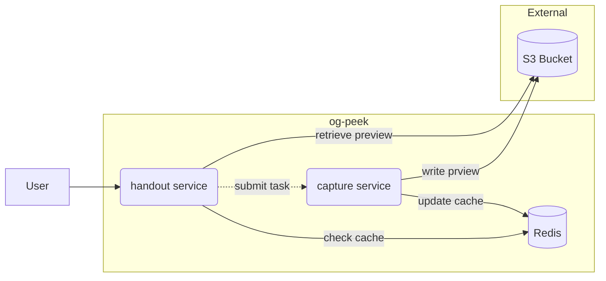

# og-peek

Makes fun previews of webpages to use as og:image meta tags

## Architecture

```mermaid
flowchart LR

    User --> handout

    subgraph og-peek
        handout(handout service)
        handout -->|check cache| redis
        handout -.->|submit task| capture

        redis[(Redis)]

        capture(capture service)

        capture -->|update cache| redis
    end

    subgraph External
        s3[(S3 Bucket)]
    end

    handout -->|retrieve preview| s3

    capture -->|write prview| s3
```